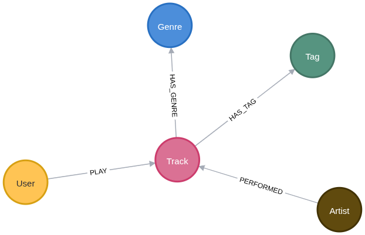

# exercicio-neo4j-recomendacao

A atividade foi resolvida utilizando como base dados disponíveis no Kaggle: [Dataset](https://www.kaggle.com/datasets/undefinenull/million-song-dataset-spotify-lastfm?resource=download).

## Importação dos dados de músicas

```
//Importando os dados das músicas
CALL {
  LOAD CSV WITH HEADERS FROM 'file:///Music%20Info.csv' AS row
  WITH row, split(row.tags, ",") AS tags

  MERGE (t:Track { trackId: row.track_id })
  SET t.name = row.name,
      t.year = toInteger(row.year),
      t.duration = toInteger(row.duration),
      t.danceability = toFloat(row.danceability),
      t.energy = toFloat(row.energy),
      t.key = toInteger(row.key),
      t.loudness = toFloat(row.loudness),
      t.mode = toInteger(row.mode),
      t.speechiness = toFloat(row.speechiness),
      t.acousticness = toFloat(row.acousticness),
      t.instrumentalness = toFloat(row.instrumentalness),
      t.liveness = toFloat(row.liveness),
      t.valence = toFloat(row.valence),
      t.tempo = toFloat(row.tempo),
      t.timeSignature = toInteger(row.time_signature)

  MERGE (a:Artist { name: row.artist })
  MERGE (a)-[:PERFORMED]->(t)

  FOREACH (_ IN CASE WHEN row.genre IS NOT NULL AND row.genre <> "" THEN [1] ELSE [] END |
    MERGE (g:Genre { name: row.genre })
    MERGE (t)-[:HAS_GENRE]->(g)
  )

  WITH t, tags
  UNWIND tags AS tag
  WITH t, tag WHERE tag IS NOT NULL AND trim(tag) <> ""
  MERGE (ta:Tag { name: trim(tag) })
  MERGE (t)-[:HAS_TAG]->(ta)
} IN TRANSACTIONS OF 1000 ROWS;

//Criando índice para as Tracks nos IDs
CREATE INDEX FOR (t:Track) on t.trackId
```

## Importando dados de usuários
```
//Carregando os usuários e a contagem - Foi necessário limitar a 100.000 linhas devido às limitações de memória do container
:auto CALL {
  LOAD CSV WITH HEADERS FROM 'file:///User%20Listening%20History.csv' AS row
  WITH row
  LIMIT 100000

    MATCH(t:Track{trackId:row.track_id})

    MERGE(u:User{userId:row.user_id})

    MERGE(u)-[r:PLAY]->(t)
    SET r.playCount = toInteger(row.playcount)

} IN TRANSACTIONS OF 1000 ROWS;

CREATE INDEX FOR (u:User) on u.userId
```

## Schema dos dados importados


## Recomendação com base nas tags em comum

Recomendando 10 músicas com tags semelhantes a Under the Bridge do Red Hot Chilli Peppers
```
MATCH (t1:Track {trackId: "TRIODZU128E078F3E2"})-[:HAS_TAG]->(tag)<-[:HAS_TAG]-(t2:Track)
WHERE t1 <> t2
RETURN t2.name AS recommended,
       count(tag) AS commonTags
ORDER BY commonTags DESC
LIMIT 10;
```

## Recomendação com base nas músicas ouvidas por um usuário (quem ouviu essa música, também ouviu...)
```
MATCH (target:User {userId: "4e11f45d732f4861772b2906f81a7d384552ad12"})-[:PLAY]->(t)
MATCH (other:User)-[:PLAY]->(t)
WHERE other <> target

MATCH (other)-[:PLAY]->(rec)
WHERE NOT (target)-[:PLAY]->(rec)

RETURN rec.name AS recommended, count(*) AS score
ORDER BY score DESC
LIMIT 10;
```
